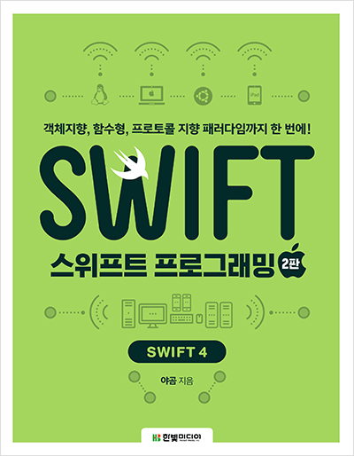

# StudySwift
스위프트 공부 기록.
### 공부참고
- [야곰(keyWindow)님의 스위프트 무료강좌](https://www.youtube.com/watch?v=2n-fSlW-jts&list=PLz8NH7YHUj_ZmlgcSETF51Z9GSSU6Uioy&index=1)
- 스위프트 프로그래밍 2판: 객체지향, 함수형, 프로토콜 지향 패러다임까지 한 번에!(Swift 4) / 곧 볼예정.. ㅎ

